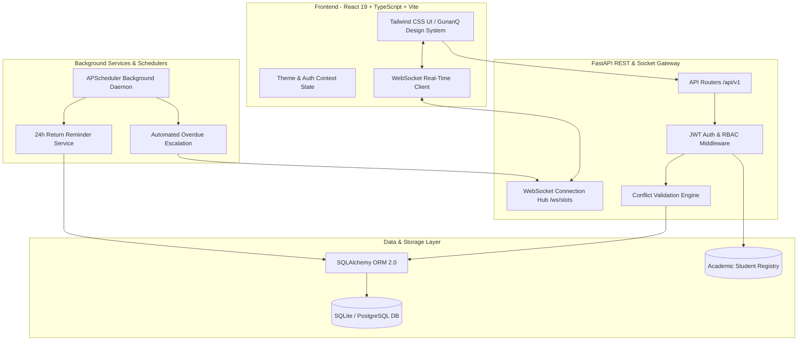

# 🏛️ Smart Campus Equipment & Lab Booking System

<div align="center">

[](https://fastapi.tiangolo.com)
[](https://react.dev)
[](https://www.typescriptlang.org/)
[](https://tailwindcss.com)
[](https://vitejs.dev)
[](https://fastapi.tiangolo.com/advanced/websockets/)
[](https://smart-campus-equipment-lab-booking-system-55gbkjncj.vercel.app)
[](https://smart-campus-equipment-lab-booking.onrender.com/docs)
[](https://opensource.org/licenses/MIT)

**An enterprise-grade, full-stack laboratory resource management and hardware booking platform engineered for universities and academic research institutes.**

🔗 **Live Application**: [https://smart-campus-equipment-lab-booking-system-55gbkjncj.vercel.app](https://smart-campus-equipment-lab-booking-system-55gbkjncj.vercel.app)  
📖 **Interactive API Docs**: [https://smart-campus-equipment-lab-booking.onrender.com/docs](https://smart-campus-equipment-lab-booking.onrender.com/docs)

[Key Features](#-key-features) • [System Architecture](#-system-architecture) • [Live Demo Credentials](#-pre-seeded-demo-accounts) • [Campus Directory](#-campus-lab-directory--floor-mapping) • [API Reference](#-api-endpoints-summary) • [SE Lab Curriculum Mapping](#-software-engineering-lab-curriculum-mapping) • [Local Setup](#-setup--running-locally)

</div>

---

## 📌 Executive Summary

Traditional university laboratories rely on fragmented paper logbooks, manual registers, and ad-hoc emails. This leads to double-booking conflicts, unverified student claims, equipment hoarding, and zero tracking of damaged or overdue units.

**Smart Campus Equipment & Lab Booking System** solves these challenges through an end-to-end digital OS that combines **conflict-free time-slot reservations**, **real-time WebSocket updates**, **automated student enrollment verification**, **predictive maintenance escalation**, and **interactive executive analytics**.

---

## ✨ Key Features

### ⚡ 1. Conflict-Free Slot Booking Engine
* **Mathematical Overlap Detection**: Rejects any booking attempting `(start_time < existing.end_time) AND (end_time > existing.start_time)` across all active reservations (`pending`, `approved`, `checked_out`, `overdue`).
* **Microsecond Race-Condition Guard**: Instant `HTTP 409 Conflict` response with real-time feedback.

### 🔄 2. Live WebSocket Slot Synchronization (`/ws/slots`)
* Broadcasts real-time slot state changes (lock, approve, checkout, return) to all connected clients.
* Instant visual timeline updates on interactive calendars without requiring a page refresh.

### 🛡️ 3. Official Institutional Roster Verification
* Cross-checks student registration details against pre-seeded academic enrollment registries.
* Automatically flags unverified student numbers and highlights matching cohort, department, and official student names in the Admin Approvals Queue.

### 📦 4. Finite State Machine & Immutable Audit Trail
* Robust state transitions: `AVAILABLE` ➔ `BOOKED` ➔ `ISSUED` ➔ `RETURNED` (or `OVERDUE` / `UNDER_MAINTENANCE`).
* Full lifecycle logging recording actor user IDs, handover condition notes, inspection remarks, and timestamps.

### ⏱️ 5. Automated Background Worker (APScheduler)
* **24-Hour Return Reminders**: Scans reservations every 60 seconds and dispatches reminder notifications to students.
* **Overdue Escalations**: Automatically flags unreturned units past deadline, alerts lab assistants, and triggers overdue telemetry.

### 🎨 6. GunanQ-Inspired Modern Design System
* Pure white card elevations with ambient lighting in **Light Mode** and deep slate glassmorphism in **Dark Mode**.
* Distinguishable categorical navigation icons with interactive hover pop-out physics.
* High-contrast typography, rubric-style status pills, and translucent frosted-glass modal scrims.

---

## 🏗️ System Architecture



---

## 👥 Role-Based Access Matrix

| Feature / Capability | Student / Researcher | Lab Assistant / Faculty | System Administrator |
| :--- | :---: | :---: | :---: |
| Browse Equipment & Filter by Specs | ✅ | ✅ | ✅ |
| Check Interactive Calendar Availability | ✅ | ✅ | ✅ |
| Submit Slot Requisition with Justification | ✅ | ❌ | ❌ |
| Track Active Bookings & Return Countdowns | ✅ | ❌ | ❌ |
| Review Requisitions Queue (Approve / Reject) | ❌ | ✅ | ✅ |
| Perform Physical Handover & Return Inspection | ❌ | ✅ | ✅ |
| Flag Physical Damage & Open Maintenance Tickets | ❌ | ✅ | ✅ |
| Master Inventory CRUD (Add/Edit/Delete Equipment) | ❌ | ❌ | ✅ |
| University Roster Verification & Account Approvals| ❌ | ❌ | ✅ |
| Executive Recharts Analytics & KPI Dashboard | ❌ | ❌ | ✅ |

---

## 🔑 Pre-Seeded Demo Accounts

The frontend includes a **1-Click Quick Persona Switcher** on the top navigation bar for immediate testing without typing:

| Role | Demo Email | Password | Persona & Department |
| :--- | :--- | :--- | :--- |
| **Student** | `student@campus.edu` | `campus123` | Alex Rivera — Computer Science & AI |
| **Lab Assistant** | `assistant@campus.edu` | `campus123` | Dr. Sarah Chen — Electronics & Hardware Staff |
| **System Admin** | `admin@campus.edu` | `campus123` | Prof. Marcus Vance — Dean of Academic Labs |
| **Researcher** | `researcher@campus.edu` | `campus123` | Maya Patel — Autonomous Robotics Graduate Student |

---

## 🏢 Campus Lab Directory & Floor Mapping

All laboratory spaces and hardware resources are mapped accurately across campus infrastructure:

### BVS Block
* **Floor 3**: Software Engineering Lab, Compiler Design Lab, DBMS Lab, Programming in Java Lab, OOPS (C++) Lab, Physics Lab
* **Floor 2**: Chemistry Lab

### MMS Block
* **Floor 2**: Computer Network Lab, Computational Methods Lab, IT Lab, CAD Lab, Cyber Security Lab, Smart Room, DLCD Lab, Programming in C Lab
* **Floor 1**: Engineering Graphics Lab, AI Lab, Computer Centre
* **Ground Floor**: Mechanical Workshop, Electrical Lab

---

## 📚 Software Engineering Lab Curriculum Mapping

This system serves as a reference implementation for university **Software Engineering / OOAD (Object-Oriented Analysis & Design)** practicals:

| Exp No. | Experiment Title | Implementation in this Repository |
| :---: | :--- | :--- |
| **Exp 1** | **Problem Statement** | Resolution of manual paper logbooks, slot collision, and inventory leakage across academic blocks. |
| **Exp 2** | **Requirement Analysis & SRS** | Complete IEEE 830 functional (FR) and non-functional (NFR) requirements specification. |
| **Exp 3** | **DFD & Structure Charts** | Level 0 Context Diagram, Level 1 & 2 Process Decompositions, and Modular Structure Chart. |
| **Exp 4** | **Entity-Relationship (ER) Diagram** | Relational data schema (`User`, `Lab`, `Equipment`, `Booking`, `MaintenanceLog`, `StudentRegistry`). |
| **Exp 5** | **Use Case Diagram** | Actor interactions (`Student`, `Lab Assistant`, `Admin`, `Scheduler`) with `<<include>>` and `<<extend>>`. |
| **Exp 6** | **Class & Object Diagrams** | Detailed UML class structures (SQLAlchemy / Pydantic models) and runtime object instances. |
| **Exp 7** | **State-Chart & Activity Diagrams** | Booking lifecycle state machine and multi-swimlane reservation activity flows. |
| **Exp 8** | **Sequence & Collaboration Diagrams** | Message timeline for slot allocation, database lock, WebSocket broadcast, and approval. |
| **Exp 9** | **Component Diagram** | Structural decoupling of Frontend SPA, FastAPI Engine, JWT Middleware, and ORM Persistence. |
| **Exp 10** | **Deployment Diagram** | Hardware nodes: Client Browser $\leftrightarrow$ Uvicorn Application Server $\leftrightarrow$ Database Storage. |
| **Exp 11** | **Full System Implementation** | Fully functional, production-ready codebase running locally and on GitHub! |

---

## 🚀 Setup & Running Locally

### Prerequisites
* **Python**: 3.10+ (Tested on Python 3.12 / 3.14)
* **Node.js**: 18.0+ & `npm`

### 1. Backend Setup
```bash
# Navigate to backend directory
cd backend

# Create virtual environment
python -m venv venv

# Activate virtual environment
# Windows:
.\venv\Scripts\activate
# Linux/macOS:
# source venv/bin/activate

# Install dependencies
pip install -r requirements.txt

# Start backend server (automatically initializes & seeds SQLite DB on first run)
python run.py
```
* Backend API: **`http://localhost:8000`**
* Interactive Swagger Docs: **`http://localhost:8000/docs`**
* Redoc Alternative Docs: **`http://localhost:8000/redoc`**

### 2. Frontend Setup
```bash
# Navigate to frontend directory in a separate terminal
cd frontend

# Install npm dependencies
npm install

# Start Vite development server
npm run dev
```
* Frontend Application: **`http://localhost:5173`**

---

## 🔌 API Endpoints Summary

### Authentication (`/api/auth`)
* `POST /api/auth/register` — Register student/faculty account with enrollment verification
* `POST /api/auth/login` — Authenticate and receive signed JWT Bearer token
* `GET /api/auth/me` — Retrieve active profile & assigned roles

### Equipment & Labs (`/api/equipment`, `/api/labs`)
* `GET /api/equipment` — Filter hardware by category, block, lab, availability, or keyword
* `GET /api/equipment/{id}/lifecycles` — Retrieve immutable audit trail of past handovers
* `POST /api/equipment` — Provision new equipment (Admin)
* `PUT /api/equipment/{id}` — Update hardware specifications or active status
* `DELETE /api/equipment/{id}` — Decommission hardware resource
* `GET /api/labs` — Retrieve campus lab facilities with floor & block metadata

### Bookings & Queue (`/api/bookings`)
* `POST /api/bookings` — Request a time slot (triggers $O(1)$ overlap validation)
* `GET /api/bookings/my` — Fetch current user's reservations and countdowns
* `GET /api/bookings/calendar` — Fetch slot bookings for a target date & resource
* `GET /api/bookings/queue` — Staff requisition approval queue
* `PUT /api/bookings/{id}/review` — Approve or reject booking with remarks
* `POST /api/bookings/{id}/checkout` — Complete physical checkout inspection
* `POST /api/bookings/{id}/checkin` — Inspect return and flag physical damage
* `POST /api/bookings/{id}/cancel` — Cancel pending/approved reservation

### Maintenance & Damage (`/api/maintenance`)
* `GET /api/maintenance` — Active equipment damage & repair tickets
* `POST /api/maintenance` — Log repair ticket and transition unit to `under_maintenance`
* `PUT /api/maintenance/{id}` — Resolve repair ticket and restore unit to `available`

### Analytics Dashboard (`/api/analytics`)
* `GET /api/analytics/dashboard` — Master metrics (KPIs, utilization rates, peak hours, overdue rates)

---

## 📄 License & Attribution

Distributed under the **MIT License**. See `LICENSE` for more information.

Developed with ❤️ for Academic Research & University Campus Infrastructure by **[Vansh-Codez](https://github.com/Vansh-Codez)**.
